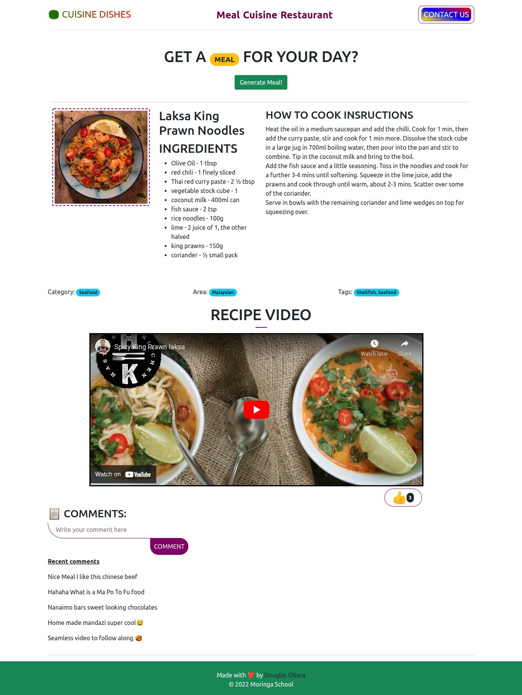

# Phase 1 Final Project : Cuisine Dishes Restaurant

## Learning Goals 🖊️

- Access information from an API using a `GET` request and use it to update the
  DOM
- Listen for user events and update the `DOM` in response
- Fetch the information from user input and use `POST` method to submit data to local db server

## Introduction 🚀

This is a restaurant called `CUISINE DISHES` that educates people on how to cook different kinds of foods from different countries and showing them the name of the meal, Ingredients to use, Instructions on how to cook and the video tutorial to showcase how the meals are prepared by differents experts in the field, in addition users can be able to like and comment about the video tutorial.

## Screenshot 📸

- This the final project design
  <a href="https://douglas254.github.io/FS-Moringa-Projects/Phase-1/Final-Project/index.html">
  <a>

## Setup ✴️

- Run `json-server --watch db.json` to get the backend started
- Open the `index.html` file on your browser

## Endpoints API 🛠️

Your base URL API for storing comments in db.json: `http://localhost:3000/comments`

✅ [TheMealDBAPI](https://www.themealdb.com/api.php)

## Core Deliverables 📈

As a user 👨‍💻, I can:

- Be able to generate a random meal using the `Generate Meal!` button
- Be able to view the procedures for cooking a certain type of food
- Watch a video tutorial for preparation of the displayed food
- Be able to comment on a type of food that is displayed and give it a like 👍
